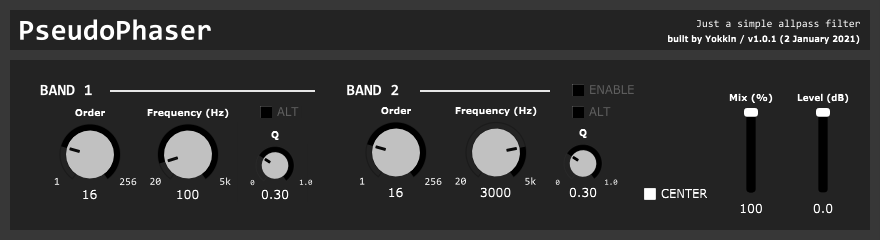

# PseudoPhaser

A serially connected all-pass filter.

Documents and troubleshooting about this plugin are available on wiki.

[https://github.com/froggie3/PseudoPhaser/wiki](https://github.com/froggie3/PseudoPhaser/wiki)
